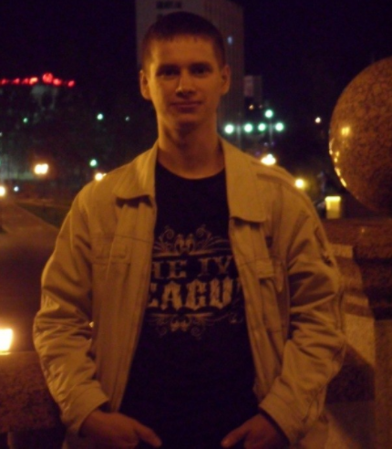

# Gennady Arashkevich

---

## Contacts:

- telephone: +375295026046
- emal: oreshkevich85@mail.ru

## Summary:

- Analytical mindset
- Efficiency
- Persistence
- Without bad habits
- I do sports.

## Skills:

- HTML, CSS
- Java Script
- Visual Studio Code
- Git
- SCSS

## [Code sample][1]

[1]: https://oreshkevich.github.io/willberries/

## Work experience:

---

- _May 2008 - May 2010_
  **GLKHU "Borisovskiy experimental forestry"**.
  - Forester -- supervised forestry activities
- _May 2010 - October 2019_
  **RDUP "Vitebsklesproekt"**.
  - Leading engineer
- _From 2020 till now_
- Craftsman. Learning by online courses and books on HTML, CSS, JavaScript programming

## Education:

---

- **Belarusian State Technological University, Minsk**

  - Forestry engineer.

- **International Institute of Economics and Law, Moscow**

  - Manager, specialty "Organizational Management"

- Self-education in web development in 2020
  English at A1 level for now
